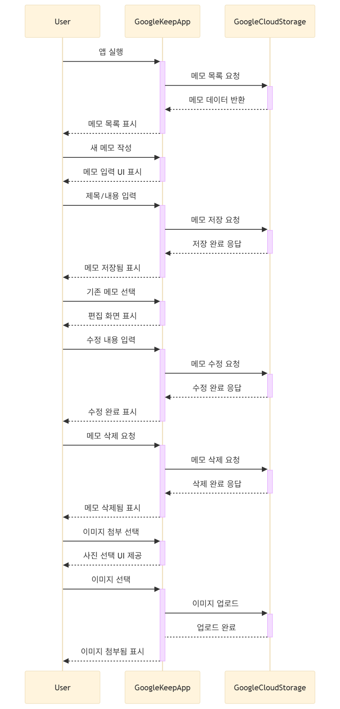
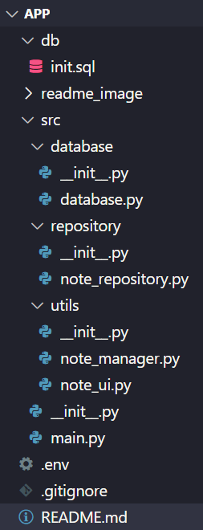
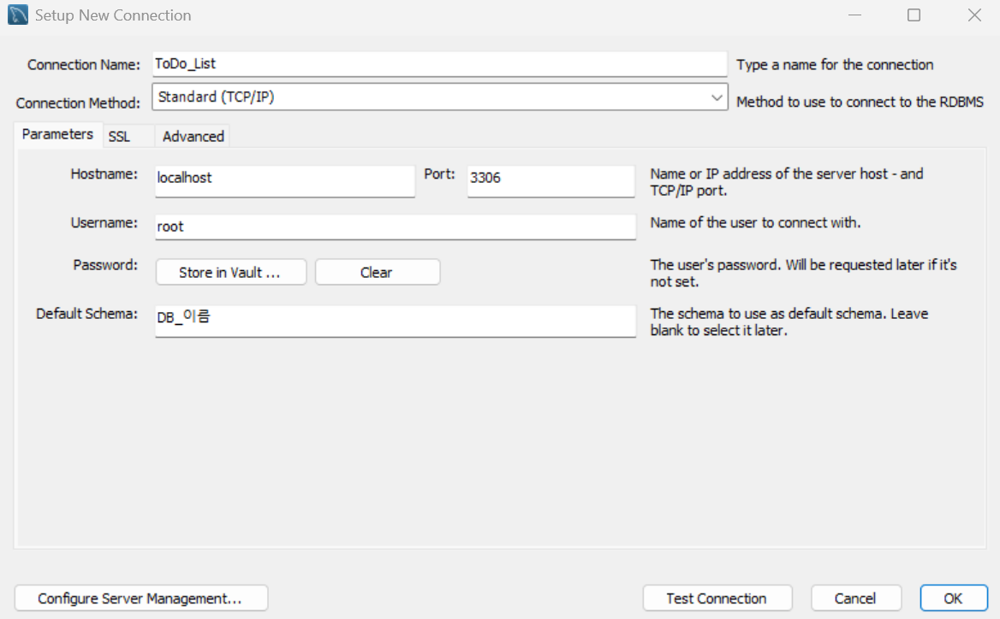

# 📖 개인 실습과제1
### 과제 설명
일상 속 소프트웨어 사용 사례를 주제로 시퀀스 다이어그램을 작성하고, 이를 기반으로 샘플 코드를 구현합니다.

>a. 시퀀스 다이어그램: 시퀀스 다이어그램으로 모델링 – Mermaid.live 활용  
>b. 샘플 코드: 시퀀스 다이어그램을 기반으로 구현 (원시코드)  
>c. 샘플 코드의 모듈 평가 결과 간략히 작성 (샘플 코드의 응집도, 결합도 평가)  
>d. a~d 까지의 모든 내용을 GitHub 개인 저장소에 업로드 
 
# 📌 목표앱

  

### Google Keep
Google Keep을 선정하게된 이유는 Google Keep의 기능들이 직관적이고 다양한 기능 대신에 꼭 필요한 필수적인 기능만 탑제하고 있는 앱이어서 선택하게 됐습니다. 또한 시퀀스 다이어그램으로 보기에 직관적이어서 선정하게 되었습니다.

# 📊 시퀀스 다이어그램
### Google Keep 의 시퀀스 다이어 그램

시퀀스 다이어 그램입니다. 구성은 user, GoogleKeepApp, GoogleCloudStorage입니다. user는 유저인터페이스(UI)를 통해서 앱을 동작하고 GoogleKeepApp에서 동작을 입력받아서 user의 명령을 수행합니다. 그후 메모의 저장 수정 삭제 요청과 이미지 업로드 명령을 입력받아서 수행합니다. 명령을 수행한뒤 수정 삭제 요청은 Database에 업로드 합니다.

# 💻 샘플 코드
## 📁 파일 구성
 

## 📖 코드별 기능
먼저 각 코드들의 기능에 따라서 파일을 나누었습니다. 

### GoogleCloudStorage
`init.sql`과 `database`는 각각 SQL 쿼리문과 데이터베이스를 생성하는 코드를 모아놓은 구성입니다. 그리고 `repository`는 `init.sql`과 `database`를 통해 생성된 데이터베이스를 실제로 **조작**(**조회**,**추가**,**수정**,**삭제**)할 수 있도록 쿼리 명령을 포함하고 있습니다.
이러한 구조는 시퀀스 다이어그램 상에서 `GoogleCloudStorage`에 해당한다고 볼 수 있습니다.

### GoogleKeepApp
`utils` 폴더의 `note_manager`는 메모의 추가, 수정, 삭제와 같은 핵심 로직을 담당하며, `note_ui`는 사용자가 직접 마주하게 되는 **UI**(**인터페이스**)를 구성합니다.
마지막으로 `main`은 `note_manager`와 `note_ui`를 통합하여 실행시키는 **시작 지점**(**Entry Point**)으로, 프로젝트의 최상위에서 앱 전체를 구동합니다.
이러한 구성 요소들은 시퀀스 다이어그램에서 `GoogleKeepApp`에 해당하는 부분이라 볼 수 있습니다.

## 📥 다운로드
### ✅ DB(MySQL) 설치
1. MySQL을 설치한다.  
(Version): 8.0.39  

2. DB를 설정한다.

DB_HOST = localhost  
DB_USER = root  
DB_NAME = my_sql_db (Default Schema)  
DB_PORT = 3306  
으로 설정합니다. 비밀번호는 각자 로그인합니다.

1. .env파일과 연동시킵니다.  
>DB_HOST=  
>DB_USER=  
>DB_PASSWORD=    
>DB_NAME=  
>DB_PORT= 

---
### ✅ main install
#### pip 설치 버전
>mysql-connector-python==9.3.0   
>python-dotenv==1.1.0  

#### 설치하기(최신버전)
>pip install mysql-connector-python python-dotenv

mysql 연결, .env파일 사용

#### 실행하기
>python -m src.main 

# 🔍 모듈평가
### ✅ 응집도
응집도란?  
각 모듈이 하나의 명확한 책임만을 수행할 수 있도록 분리하는 것이며 응집도는 높을 수록 좋습니다.  

### ✅ 결합도
결합도란?  
각 모듈간의 관련이 적고 상호 의존성이 줄어 모듈이 독립적인 상태입니다. 결합도는 낮을 수록 좋습니다.  

## 🔍 평가
### init.sql 파일
MySQL 테이블을 생성합니다. 쿼리문만 작성되어 있습니다.

>응집도: 기능적 응집  
이유: 테이블 생성이라는 단일 목적만 수행합니다.  

>결합도: 외부 결합  
이유: 두 모듈이 공통된 외부 형식(.env 파일)에 의존하고 있기 때문입니다.  

---
### database 파일
MySQL 연결 및 초기화만 담당합니다. 또한 init.sql 파일을 실행 시킵니다.  
>응집도: 기능적 응집  
이유: DB 연결과 초기화만 담당합니다.  

>결합도: 외부 결합  
이유: 환경변수 파일 포맷의 키 이름 등 .env파일에 많이 의존합니다.  

---
### note_repository 파일
SQL 쿼리 실행만 담당합니다
>응집도: 기능적 응집  
이유: SQL (삽입, 조회, 수정, 삭제) 실행문만 수행합니다.

>결합도: 스템프 결합  
이유: note_repository는 database 객체 전부를 받지만 사용하는 것은 cursor만 사용합니다. 즉, 하나의 데이터만 필요한데 레코드 전체가 넘어왔다고 볼 수 있습니다.

---
### note_manager 파일
메모의 기능인 (추가/수정/삭제)을 담당합니다.  

>응집도: 논리적 응집  
이유: 삽입 삭제 수정 기능뿐만 아니라 유저에게 입력받았을때 데이터의 형태를 점검하는 로직 뿐만아니라 입력 받는 로직도 있어서 기능적으로 밀접하고 생각했습니다.  

>결합도: 제어 결합  
이유: input은 note_ui에서 처리하는것이 좋지만 note_manager에서 처리하고 있습니다. 또한 해당 값이 올바른 형식인지 검사도 하고 있기 때문에 파일을 나누어 주는것이 훨씬 효율적일것 같습니다.  

---
### note_ui 파일
사용자 인터페이스 출력 및 입력 처리만 담당합니다.  

>응집도: 우연적 응집  
이유: 다양한 인터페이스(로딩이펙트, 입출력, 파일 오류처리 등등)의 코드들이 있어서 기능적으로도 밀접해있지않고 우연하게 밀집되어있는것 같다는 생각이 들었습니다.   

>결합도: 공동 결합도  
이유: 유져가 사용하는 UI와 입출력이 섞여있고 정보은닉이 되지 않았습니다((note_ui -(참조)-> manger -(참조)-> note_repository -(참조)-> Database)이렇게 참조하며 note_ui는 manager만 참조 해야하는데 note_repository 까지 참조하고 있음)  

---
### main 파일
모듈화된 파일을 흐름에 따라 실행시킵니다.  

>응집도: 기능적 응집  
이유: 전체 앱의 실행 흐름 구성이라는 하나의 역활만 수행한다고 생각했습니다. 

>결합도: 제어결합  
이유: 파일들을 논리적인 흐름으로 묶어놓았기 때문입니다.  
